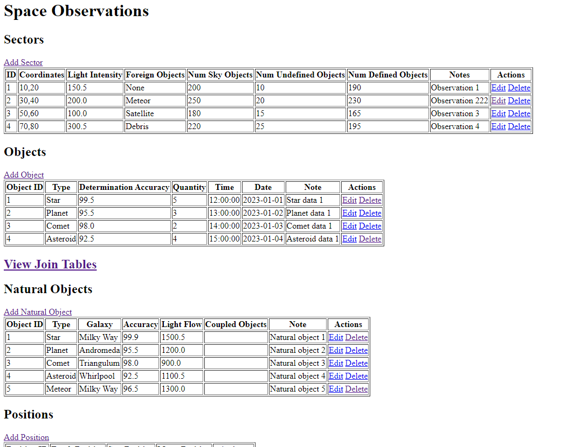
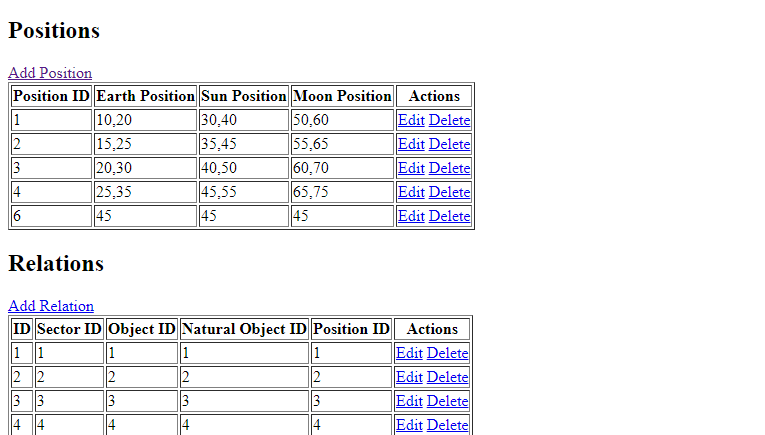
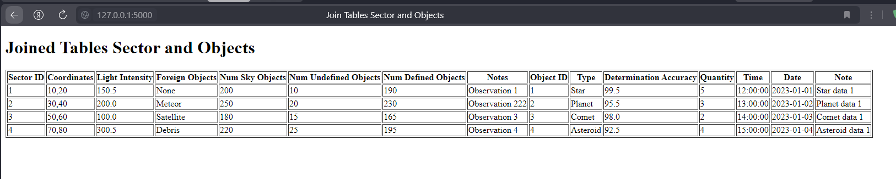
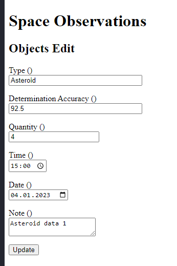
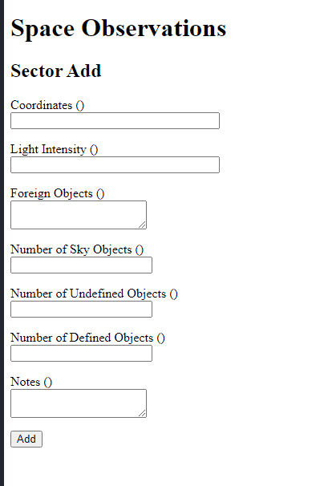
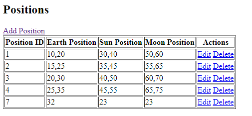
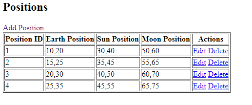
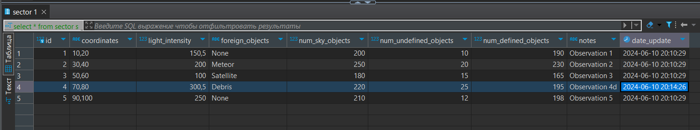

# Вторая лабораторная работа по базам данных
Скрипт для создания БД: [скрипт](SpaceObservations.sql)

Схема состоящая из пяти таблиц: [скрипт](images/schema.png)

Используемый язык для реализации поставленной задачи: Python

## Триггер

Указанный триггер невозможно создать, т.к. в тригерах нельзя выполнять команды DDL. Однако был создан тригер, который при изменении объекта обновляет значение столбца date_update в записи

## Запуск
Для запуска необходимо установить все зависимости:
```
python -m pip install Flask Flask-SQLAlchemy Flask-WTF mysql-connector-python flash
```
После чего запустить проект с помощью команды:
```
python index.py
```

## Скриншоты созданного приложения
Для изменения, добавления и удаление доступны все объекты. Предусмотрена обработка ошибок, например, при попытке удалить объект, на который ссылается другой объект в БД.
### Все таблицы


### Join процедура

### Форма изменения объекта

### Форма добавления объекта


### Удаление

### Работа триггера



